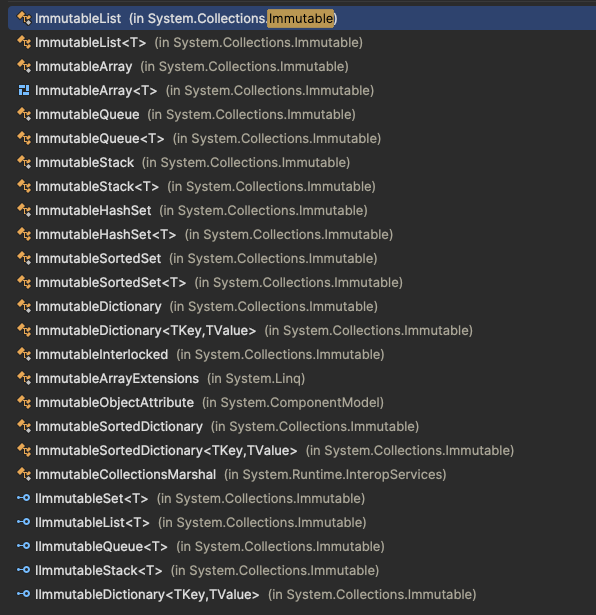
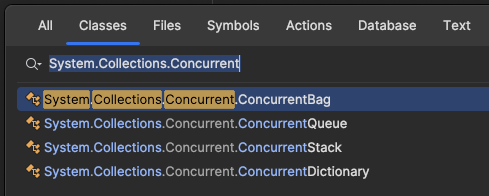

# Data structures and algorithms

## Data structures

### Mutable Collections

- [ ] Array

- [ ] List

- [ ] Dictionary

- [ ] HashSet

- [ ] Tuple

- [ ] Ranges

- [ ] Stack

- [ ] Queue

- [ ] LinkedList

- [ ] SortedList

- [ ] SortedDictionary

- [ ] SortedSet

- [ ] BitArray

- [ ] NameValueCollection

- [ ] Hashtable

### Immutable Collections

### Concurrent Collections

- [ ] ReadOnlyCollection

- [ ] ReadOnlyDictionary

### Trees

- [ ] Binary tree
- [ ] AVL tree
- [ ] Red-black tree
- [ ] B-tree
- [ ] B+ tree
- [ ] Splay tree
- [ ] Tries
- [ ] Segment tree
- [ ] Fenwick tree
- [ ] Binary indexed tree
- [ ] Quadtree
- [ ] Octree
- [ ] KD-tree
- [ ] Interval tree
- [ ] Range tree
- [ ] Suffix tree

### Graphs
- [ ] Graph representation
- [ ] Breadth-first search
- [ ] Depth-first search

- [ ] Longest path problem
- [ ] Shortest path problem

- [ ] Dijkstra's algorithm
- [ ] Bellman-Ford algorithm
- [ ] Floyd-Warshall algorithm
- [ ] Prim's algorithm
- [ ] Kruskal's algorithm
- [ ] Topological sort
- [ ] Tarjan's algorithm
- [ ] Kosaraju's algorithm
- [ ] Edmonds-Karp algorithm
- [ ] Ford-Fulkerson algorithm
- [ ] Hopcroft-Karp algorithm
- [ ] Dinic's algorithm
- [ ] A* search algorithm
- [ ] IDA* search algorithm
- [ ] Johnson's algorithm
- [ ] Hierholzer's algorithm
- [ ] Fleury's algorithm
- [ ] Chinese postman problem
- [ ] Traveling salesman problem
- [ ] Hamiltonian path problem
- [ ] Hamiltonian cycle problem
- [ ] Maximum flow problem
- [ ] Minimum spanning tree problem
- [ ] Graph coloring problem
- [ ] Vertex cover problem
- [ ] Independent set problem
- [ ] Clique problem
- [ ] Set cover problem
- [ ] Feedback vertex set problem
- [ ] Feedback arc set problem
- [ ] Directed acyclic graph problem
- [ ] Network flow problem
- [ ] Network design problem
- [ ] Network optimization problem
- [ ] Network reliability problem

## Algorithms

- [ ] Merge sort
- [ ] Quick sort
- [ ] Bubble sort
- [ ] Insertion sort
- [ ] Selection sort
- [ ] Heap sort
